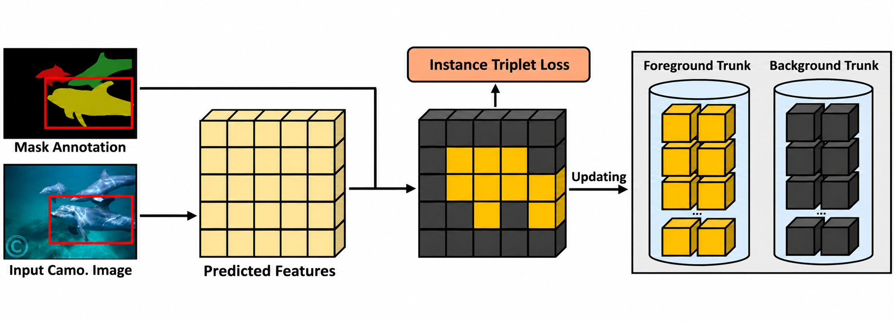
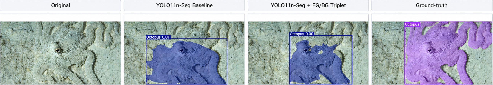
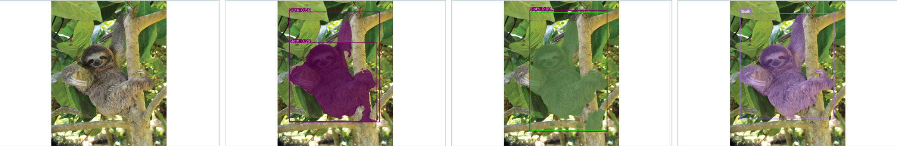
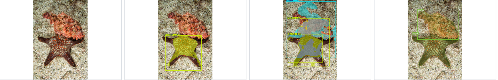
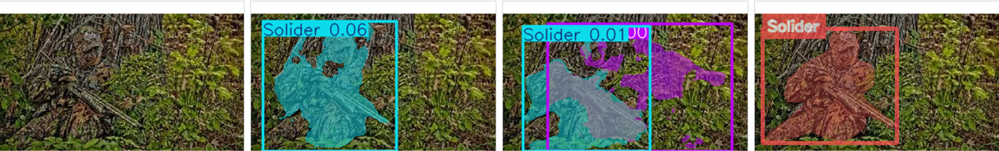
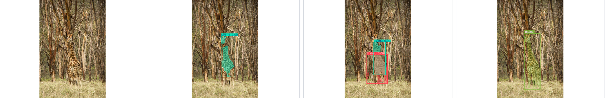
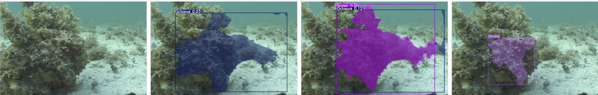
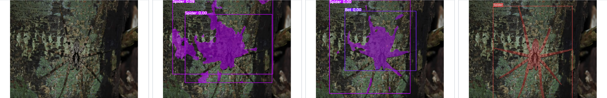

# CAMO-FS Few-Shot Detection & Instance Segmentation with YOLO11n-Seg

A reproducible few-shot benchmark for **camouflaged object detection and instance segmentation** on the **CAMO-FS** dataset using **YOLO11n-Seg**, with an auxiliary **foreground/background triplet loss**.

This repository compares two controlled training settings across **1-shot, 2-shot, 3-shot, and 5-shot** CAMO-FS experiments:

- **Baseline** — native YOLO11n-Seg training.
- **FG/BG Triplet** — the same YOLO11n-Seg training objective augmented with a foreground/background triplet loss computed from the model's P3 feature map.

All benchmark runs use the same base `yolo11n-seg.pt` checkpoint, the same seed and training budget, and are evaluated on the same official CAMO-FS test split.

---

## 1. Overview

Camouflaged objects are difficult to detect because foreground appearance can be extremely similar to the surrounding background. CAMO-FS makes the problem harder by restricting training to only a few annotated instances per class.

The goal of this project is to study whether an auxiliary feature-space objective can help a compact segmentation model learn a better separation between **camouflaged foreground** and **background** under few-shot supervision.

The benchmark contains:

| Item | Setting |
|---|---|
| Model | YOLO11n-Seg |
| Methods | Baseline, FG/BG Triplet |
| Few-shot settings | 1, 2, 3, 5 shots |
| Runs | 8 independent benchmark runs |
| Epochs | 100 per run |
| Image size | 640 |
| Batch size | 16 |
| Seed | 2024 |
| Runtime used for benchmark | Ultralytics `8.3.228` |
| GPU used for benchmark | NVIDIA Tesla T4 |

The completed benchmark passed the final run/checkpoint/evaluation audit for all **8/8 runs**.

### Main finding

The auxiliary FG/BG triplet objective **improved the 2-shot setting**, but the gain was **not consistent across all shot counts**.

For 2-shot:

- **Box AP:** `3.23 → 3.68` (**+14.23% relative**)
- **Mask AP:** `2.75 → 3.16` (**+14.91% relative**)

At 1-shot, 3-shot, and 5-shot, the baseline remained slightly stronger in overall Box AP and Mask AP.

---

## 2. Dataset

This repository uses the **CAMO-FS (Camouflaged Few-Shot)** dataset.

Detailed dataset information, few-shot annotations, split structure, statistics, and examples are documented separately in:

**[DATASET.md](DATASET.md)**

The experiments use the provided **1-shot, 2-shot, 3-shot, and 5-shot** training annotations and the shared official test split.

---

## 3. YOLO11n-Seg Method



### 3.1 Baseline

The baseline uses native **YOLO11n-Seg** training for detection and instance segmentation.

Each few-shot run starts independently from the same original:

```text
yolo11n-seg.pt
```

There is no baseline-to-enhanced checkpoint continuation.

### 3.2 FG/BG Triplet Enhancement

The enhanced method keeps the native YOLO11n-Seg objective and adds a foreground/background triplet objective on the **first spatial input to the Segment head (P3, stride 8)**.

Conceptually:

```text
Input image
    |
    v
YOLO11n-Seg backbone / neck
    |
    v
P3 feature map
    |
    +----------------------------+
    |                            |
    v                            v
Native YOLO-Seg loss       FG/BG triplet sampling
                                 |
                         Anchor / Positive:
                         same GT foreground instance
                                 |
                         Negative:
                         valid background from
                         the same image
                                 |
                                 v
                         Triplet margin loss
    |                            |
    +-------------+--------------+
                  |
                  v
            Combined loss
```

The training objective is:

```math
L_total = L_YOLO-Seg + λ L_triplet
```

where the benchmark uses:

| Hyperparameter | Value |
|---|---:|
| Triplet weight `λ` | 0.1 |
| Triplet margin | 0.3 |
| Triplets per usable instance | 16 |
| Feature source | P3 / stride 8 |


Recommended visual flow:

```text
Image + GT masks
      |
      v
YOLO11n-Seg
      |
      +---- Native box / segmentation / classification / DFL losses
      |
      +---- P3 features
               |
               +---- FG anchor
               +---- FG positive
               +---- BG negative
                        |
                        v
                  Triplet loss
```

<!-- RECOMMENDED IMAGE TO CREATE
docs/images/yolo_fgbg_triplet_pipeline.png
-->

---

## 4. Visualization

<p align="center">
  
  
  
  
  
  
  
</p>

---

## 5. Official Test Results

All reported numbers come from each completed benchmark run's own **`last.pt`** checkpoint evaluated on the shared official CAMO-FS test split.

The official evaluation configuration is fixed to:

```text
conf    = 0.001
iou     = 0.7
max_det = 300
split   = test
```

The official test split is not used for training or checkpoint selection.

> Ultralytics stores AP values as fractions in `[0, 1]`. The tables below report **AP × 100**, following the conventional COCO-style presentation.

### 5.1 Main comparison

| Shot | Baseline Box AP | FG/BG Triplet Box AP | Relative Δ | Baseline Mask AP | FG/BG Triplet Mask AP | Relative Δ |
|---:|---:|---:|---:|---:|---:|---:|
| 1 | **2.21** | 2.07 | -6.21% | **1.77** | 1.59 | -10.50% |
| 2 | 3.23 | **3.68** | **+14.23%** | 2.75 | **3.16** | **+14.91%** |
| 3 | **4.67** | 4.09 | -12.43% | **4.10** | 3.62 | -11.65% |
| 5 | **5.39** | 5.09 | -5.52% | **4.74** | 4.54 | -4.29% |


### 5.2 Full AP metrics


| Method | Shot | Box AP | Box AP50 | Box AP75 | Mask AP | Mask AP50 | Mask AP75 |
|---|---:|---:|---:|---:|---:|---:|---:|
| Baseline | 1 | 2.21 | 3.76 | 2.00 | 1.77 | 3.49 | 1.62 |
| Baseline | 2 | 3.23 | 5.21 | 3.59 | 2.75 | 5.05 | 2.68 |
| Baseline | 3 | 4.67 | 7.27 | 4.86 | 4.10 | 7.03 | 4.40 |
| Baseline | 5 | 5.39 | 8.78 | 5.30 | 4.74 | 8.23 | 4.76 |
| FG/BG Triplet | 1 | 2.07 | 3.43 | 2.19 | 1.59 | 3.05 | 1.38 |
| FG/BG Triplet | 2 | 3.68 | 5.61 | 3.80 | 3.16 | 5.82 | 3.27 |
| FG/BG Triplet | 3 | 4.09 | 6.85 | 3.94 | 3.62 | 6.84 | 3.56 |
| FG/BG Triplet | 5 | 5.09 | 8.38 | 5.01 | 4.54 | 8.19 | 4.41 |

---

## 6. Repository Structure

```text
CAMO_FewShot_YOLO-Camouflaged-Detection_and_Segmentation/
│
├── camo_fs/
│   ├── annotations.py          # COCO / few-shot annotation validation
│   ├── prepare.py              # CAMO-FS -> YOLO segmentation preparation
│   ├── segments.py             # Polygon / segmentation utilities
│   ├── valid_region.py         # Valid transformed image-region tracking
│   ├── triplet.py              # FG/BG triplet sampling and loss
│   ├── ultralytics_ext.py      # Guarded Ultralytics integration
│   ├── _ultralytics_83228.py   # Verified Ultralytics 8.3.228 bindings
│   ├── train.py                # Training orchestration and run manifests
│   ├── evaluate.py             # Official-test evaluation
│   ├── visualize.py            # Deterministic prediction visualization
│   ├── runs.py                 # Run identity, hashing, manifests, summaries
│   └── paths.py                # Canonical dataset/work paths
│
├── scripts/
│   ├── prepare_dataset.py
│   ├── train_yolo.py
│   ├── evaluate_yolo.py
│   └── visualize_predictions.py
│
├── tests/
│   ├── test_annotations.py
│   ├── test_prepare.py
│   ├── test_triplet.py
│   ├── test_ultralytics_ext.py
│   ├── test_ultralytics_integration.py
│   ├── test_train.py
│   ├── test_evaluate.py
│   ├── test_visualize.py
│   └── ...
│
├── docs/
│   ├── camo-fs-yolo-spec.md
│   ├── camo-fs-yolo-design-decisions.md
│   ├── camo-fs-yolo-plans.md
│   ├── camo-fs-yolo-tasks.md
│   └── images/
│
├── DATASET.md
├── preprocess_visualize.ipynb
├── requirements.txt
├── pyproject.toml
├── LICENSE
└── README.md
```

The implementation is intentionally separated into:

- **data preparation**
- **few-shot run identity/provenance**
- **native YOLO baseline training**
- **FG/BG triplet extension**
- **official test evaluation**
- **deterministic qualitative visualization**

The verified Ultralytics integration is pinned to:

```text
ultralytics==8.3.228
```

---

## 6. Citation & Acknowledgements

### CAMO-FS / FS-CDIS


If you use CAMO-FS, please cite the original authors:

```bibtex
@article{nguyen2024art,
  title={The Art of Camouflage: Few-shot Learning for Animal Detection and Segmentation},
  author={Nguyen, Thanh-Danh and Vu, Anh-Khoa Nguyen and Nguyen, Nhat-Duy and Nguyen, Vinh-Tiep and Ngo, Thanh Duc and Do, Thanh-Toan and Tran, Minh-Triet and Nguyen, Tam V},
  journal={IEEE Access},
  year={2024},
  publisher={IEEE}
}
```

### Acknowledgements

This repository builds on:

- **CAMO-FS / FS-CDIS** for the dataset and original few-shot camouflage research setting.
- **Ultralytics YOLO11n-Seg** for the detection and instance-segmentation backbone/training framework.
- **PyTorch** for model training and auxiliary-loss implementation.

The original FS-CDIS figures included above are retained only as attributed reference material. The YOLO11n-Seg baseline, FG/BG triplet integration, benchmark protocol, run auditing, and qualitative comparison in this repository are separate from the original MTFA + Memory implementation.

### License

This repository is distributed under the **Apache License 2.0**. See [LICENSE](LICENSE).
